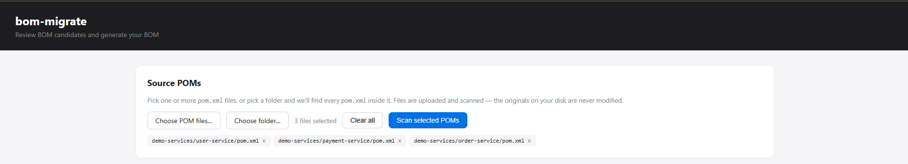
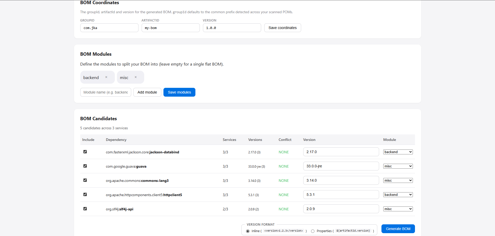
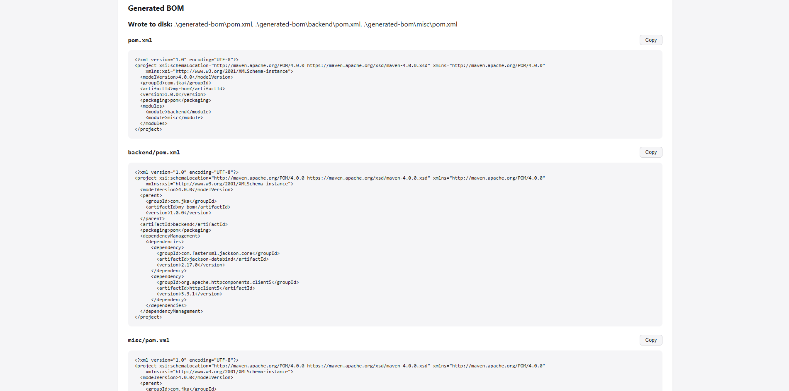
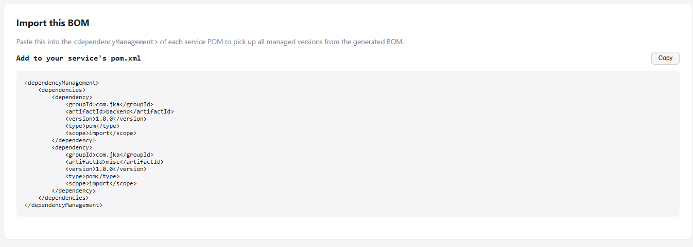
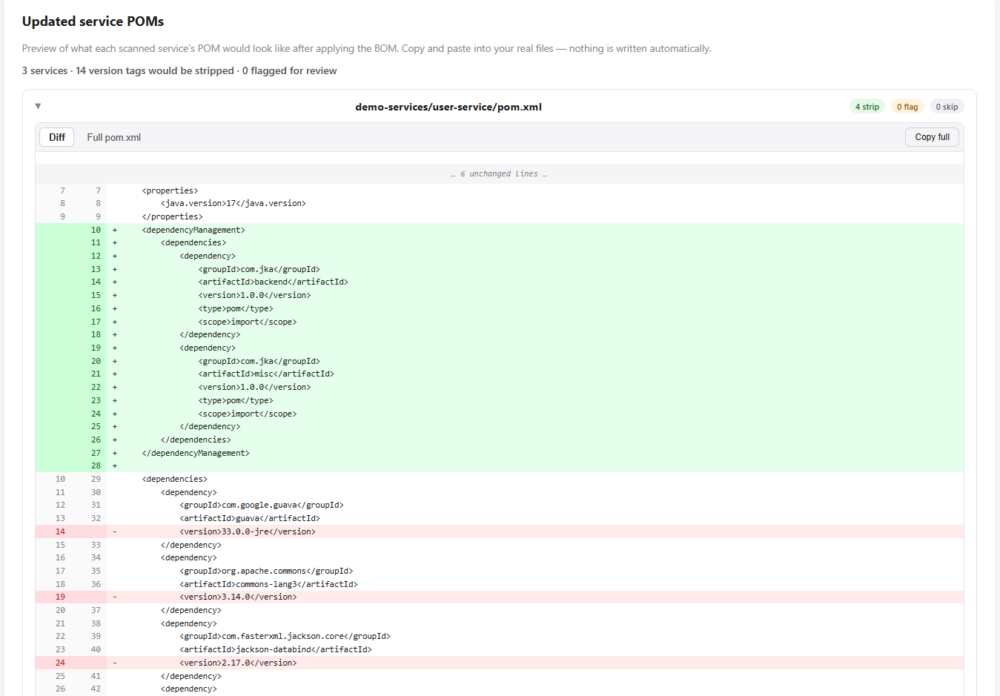

# bom-migrate

**Stop copy-pasting version numbers.** Scan your microservices, generate a Maven BOM, and migrate every service to use it — in one tool.

---

## Why?

If you work with multiple Maven microservices, you've hit these problems:

- **Version drift** — the same dependency has different versions across services, and nobody knows which is "right"
- **No central governance** — there's no BOM yet, or there is one but half the services still have hardcoded `<version>` tags
- **Manual spreadsheet work** — figuring out which deps to centralise means grepping across 20+ repos

**bom-migrate** automates the full lifecycle: discover which dependencies should be in a BOM, generate the BOM, and strip the now-redundant version tags from every service POM.

### Before & After

```xml
<!-- BEFORE: every service has its own version tags -->
<dependency>
    <groupId>com.google.guava</groupId>
    <artifactId>guava</artifactId>
    <version>33.0.0-jre</version>   <!-- ← repeated in 15 services -->
</dependency>
```

```xml
<!-- AFTER: version managed by BOM, service just declares the dep -->
<dependency>
    <groupId>com.google.guava</groupId>
    <artifactId>guava</artifactId>
</dependency>
```

---

## Quick Start

### Prerequisites

- Java 17 or later
- Your service POMs on disk (or a GitHub org to scan)

### 1. Build (or download the JAR)

```bash
git clone https://github.com/jka2498/bom-migrate.git
cd bom-migrate
mvn clean package -DskipTests
```

The fat JAR is at `bom-migrate-cli/target/bom-migrate-cli-1.2.0-SNAPSHOT.jar`.

### 2. Scan your services and launch the web UI

```bash
java -jar bom-migrate-cli/target/bom-migrate-cli-*.jar discover \
  --target ./services/* \
  --web
```

This scans every `pom.xml` under `./services/`, ranks shared dependencies, and opens an interactive web UI at [http://localhost:8080](http://localhost:8080).

> **No local services?** Use the web UI's file picker to upload individual POM files, or scan a GitHub org:
> ```bash
> export GITHUB_TOKEN=ghp_yourtoken
> java -jar bom-migrate-cli/target/bom-migrate-cli-*.jar discover --org my-org --web
> ```

### 3. Review candidates, configure modules, generate

In the web UI:

1. Review the **BOM Candidates** table — include/exclude deps, override versions, assign to modules
2. Set your **BOM Coordinates** (groupId, artifactId, version)
3. Click **Generate BOM**

The generated BOM POM files appear with copy-to-clipboard buttons. An "Import this BOM" snippet and a per-service migration preview (with a GitHub-style diff) show you exactly what changes.

### 4. Migrate your services (dry run first)

```bash
java -jar bom-migrate-cli/target/bom-migrate-cli-*.jar migrate \
  --bom ./generated-bom \
  --target ./services/* \
  --dry-run
```

Review the diffs. When ready, drop `--dry-run` to apply:

```bash
java -jar bom-migrate-cli/target/bom-migrate-cli-*.jar migrate \
  --bom ./generated-bom \
  --target ./services/*
```

Done. Every service now uses the BOM for version governance.

---

## Web UI

The `--web` flag launches an interactive review interface. Upload POMs (or pick a folder), configure your BOM, and preview exactly what each service POM will look like after migration — all copy-paste, nothing is written to disk automatically.

<!-- TODO: Replace these placeholders with actual screenshots -->

| Panel | What it does |
|-------|-------------|
|  | Pick files or folders — every `pom.xml` is found automatically |
|  | Ranked dependency table with frequency, conflicts, module assignment |
|  | Generated POM files with copy buttons |
|  | Ready-to-paste `<dependencyManagement>` block (honours Properties format) |
|  | GitHub-style red/green diff showing stripped versions + added BOM import |

> **Screenshots needed:** Run `discover --web`, walk through the flow, and capture each panel. Save images to `docs/screenshots/`.

---

## Features

### Discovery & BOM Generation
- Frequency-based candidate ranking across all scanned services
- Conflict severity detection (NONE / MINOR / MAJOR)
- Multi-module BOM generation — split deps into child modules (e.g. `backend-core`, `infra`)
- Version format choice: **inline** (`<version>1.2.3</version>`) or **properties** (`${guava.version}`)
- Auto-suggested BOM coordinates from common groupId prefix
- Minimum frequency threshold to exclude rarely-used deps

### Migration
- Format-preserving POM edits — only the `<version>` tag is removed, nothing else changes
- Orphaned property cleanup (e.g. removes `<guava.version>` from `<properties>` if no longer referenced)
- Multi-module BOM awareness — only strips deps from child modules the service actually imports
- BOM import block insertion with optional `<properties>` section
- Structured diff output (CLI and web)

### GitHub Integration
- Scan an entire GitHub org with `--org`
- Glob pattern filtering (`--repo-filter "claims-*"`)
- JVM language pre-filter (skips non-Java repos before cloning)
- Shallow-clone (depth=1) for speed
- Auto-create PRs with `--open-pr`

### Web UI
- Native file picker + folder picker (finds all `pom.xml` files in a directory tree)
- Cumulative multi-pick with per-file remove
- Display names derived from `<artifactId>` (so "pom.xml" becomes "user-service/pom.xml")
- Stale preview detection — warns when settings change after generation
- Copy-to-clipboard on every generated file and snippet
- GitHub-style red/green diff with collapsible context

---

## CLI Reference

### `discover`

| Flag | Default | Description |
|------|---------|-------------|
| `--target`, `-t` | — | Local paths to service POMs (mutually exclusive with `--org`) |
| `--org` | — | GitHub org to scan (mutually exclusive with `--target`) |
| `--web` | `false` | Launch interactive web UI |
| `--web-port` | `8080` | Port for web UI |
| `--also-migrate` | `false` | After generating, immediately migrate scanned services |
| `--bom-modules` | — | Comma-separated child module names (e.g. `"backend,misc"`) |
| `--bom-group-id` | `com.example` | groupId for generated BOM |
| `--bom-artifact-id` | `my-bom` | artifactId for generated BOM |
| `--bom-version` | `1.0.0` | version for generated BOM |
| `--version-format` | `INLINE` | `INLINE` or `PROPERTIES` |
| `--output-dir` | `./generated-bom` | Where to write the BOM files |
| `--min-frequency` | `1` | Exclude deps used by fewer than N services |
| `--dry-run` | `false` | Show report without writing files |
| `--repo-filter` | — | Glob pattern for org repos (e.g. `claims-*`) |
| `--include-all-languages` | `false` | Skip JVM language pre-filter |
| `--open-pr` | `false` | Create GitHub PR with generated BOM |
| `--github-token` | `$GITHUB_TOKEN` | GitHub token |
| `--keep-clones` | `false` | Don't delete cloned repos |
| `--clone-dir` | temp dir | Override clone directory |

### `migrate`

| Flag | Default | Description |
|------|---------|-------------|
| `--bom`, `-b` | — | Path to BOM pom.xml or directory **(required)** |
| `--target`, `-t` | — | Service POM paths (mutually exclusive with `--org`) |
| `--org` | — | GitHub org to scan |
| `--dry-run` | `false` | Print diffs without modifying files |
| `--include-transitive-bom-imports` | `false` | Resolve nested BOM imports |
| `--open-pr` | `false` | Create GitHub PR per repo |
| `--repo-filter` | — | Glob pattern for org repos |
| `--include-all-languages` | `false` | Skip JVM language pre-filter |
| `--github-token` | `$GITHUB_TOKEN` | GitHub token |
| `--keep-clones` | `false` | Don't delete cloned repos |
| `--clone-dir` | temp dir | Override clone directory |

---

## Examples

### "I have 20 services and no BOM yet"

```bash
# Scan everything, open the web UI to review
java -jar bom-migrate-cli/target/bom-migrate-cli-*.jar discover \
  --target ./services/* \
  --web
```

Review candidates in the browser, click Generate, copy the BOM files into your repo.

### "I have a BOM and want to enforce it across a GitHub org"

```bash
export GITHUB_TOKEN=ghp_...
java -jar bom-migrate-cli/target/bom-migrate-cli-*.jar migrate \
  --bom ./company-bom \
  --org my-org \
  --repo-filter "backend-*" \
  --open-pr
```

Creates one PR per repo with version tags stripped.

### "I want to split my BOM into backend + infra modules"

```bash
java -jar bom-migrate-cli/target/bom-migrate-cli-*.jar discover \
  --target ./services/* \
  --bom-modules "backend,infra" \
  --web
```

Assign each candidate to a module in the web UI. The generated BOM is a multi-module structure with a parent aggregator + one child POM per module.

### "I want to discover and migrate in one shot (CI pipeline)"

```bash
java -jar bom-migrate-cli/target/bom-migrate-cli-*.jar discover \
  --target ./services/* \
  --bom-modules "backend,infra" \
  --also-migrate \
  --dry-run
```

Non-interactive: auto-accepts all candidates, generates the BOM, migrates every service, prints diffs.

---

## How It Works

```
┌─────────────┐     ┌──────────────┐     ┌──────────────┐     ┌──────────────┐
│   Scan      │────▶│   Discover   │────▶│   Generate   │────▶│   Migrate    │
│  services   │     │  candidates  │     │   BOM POM    │     │  strip tags  │
└─────────────┘     └──────────────┘     └──────────────┘     └──────────────┘
 local / GitHub      rank by frequency    multi-module         per-service
 org / upload        detect conflicts     inline or props      format-preserving
```

### Module structure

```
bom-migrate/
├── bom-migrate-core/       # Pure library — parsing, resolution, diffing, discovery
├── bom-migrate-github/     # GitHub org scanning + JGit shallow-clone
├── bom-migrate-web/        # Spring Boot web UI (interactive review)
└── bom-migrate-cli/        # Picocli CLI (migrate + discover subcommands)
```

**Dependency direction:** `core ← github`, `core ← web`, `core + github + web ← cli`

---

## Edge Cases Handled

- Property-based versions in both BOMs and service POMs (`${guava.version}`)
- Multi-module BOM structures (parent aggregator + child modules)
- Per-service child-module matching (only strip deps the service actually imports)
- BOM-of-BOM imports (configurable transitive resolution)
- Version ranges (detected and skipped)
- Classifier and type variants (exact `groupId:artifactId:type:classifier` matching)
- Duplicate dependency declarations (flagged for review)
- Dependencies with no version tag (already managed — skipped)
- Orphaned version properties auto-cleaned after stripping
- Major version conflicts flagged as high priority
- Monorepo detection (multiple POMs per cloned repo)

## Limitations

- **Parent POM inheritance** — deps managed solely through `<parent>` (not BOM import) are classified as SKIP. Workaround: pass the parent POM as an additional `--bom`.
- **Remote BOM resolution** — BOMs referenced by GAV that aren't on the local filesystem are skipped with a warning.
- **Gradle** — not supported.
- **Plugin dependencies** — `<build><plugins>` sections are not processed.

---

## Development

### Build & test

```bash
mvn clean verify          # compile + run all 149 tests
mvn test -pl bom-migrate-core   # run core tests only
mvn clean package -DskipTests   # build fat JAR without tests
```

### Run locally

```bash
java -jar bom-migrate-cli/target/bom-migrate-cli-*.jar --help
java -jar bom-migrate-cli/target/bom-migrate-cli-*.jar discover --target ./services/* --web
java -jar bom-migrate-cli/target/bom-migrate-cli-*.jar migrate --bom ./my-bom --target ./my-service --dry-run
```

### Tech stack

- Java 17 runtime / Java 21 build
- Maven multi-module (4 modules)
- Picocli 4.7 for CLI
- Spring Boot 3.5 for web UI
- JGit for shallow-clone
- No frontend build step — vanilla HTML/CSS/JS in `bom-migrate-web/src/main/resources/static/`

### Legacy syntax

For backward compatibility with V1 scripts, omitting the subcommand defaults to `migrate`:

```bash
# These two are equivalent:
java -jar bom-migrate-cli-*.jar --bom ./my-bom --target ./my-service
java -jar bom-migrate-cli-*.jar migrate --bom ./my-bom --target ./my-service
```
